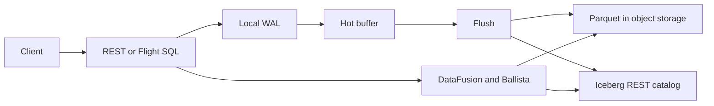

<div align="center">
  <h1>TeoDB</h1>
  <p><strong>An experimental OLAP database written in Rust.</strong></p>
  <p><em>Dedicated to my son, Teoman.</em></p>
</div>

TeoDB uses Apache Arrow, DataFusion, Apache Iceberg, Parquet, object storage, and Ballista.

The project is in active development. It is useful for learning and testing database ideas. It is not ready for production use.

## Main Features

- REST and Arrow Flight SQL APIs.
- WAL-backed ingest.
- Explicit and timed flush to Parquet files.
- Iceberg table metadata and snapshots.
- DataFusion query planning and execution.
- Ballista scheduler and executors.
- S3-compatible object storage.
- Local cache and spill files.
- Docker Compose and Helm examples.
- A Vue admin UI.

## Important Limits

- An ingest reply means the data is in the local WAL. It does not mean a query can read the data.
- A query can read new rows after flush commits an Iceberg snapshot.
- WAL and hot-buffer data are not copied to other nodes.
- Idempotency keys belong to one writer. They are not cluster-wide.
- There is no row-level MVCC, automatic sharding, or secondary index.
- Compaction is off by default. The current Iceberg Rust API does not provide the replace action that TeoDB needs.
- Snapshot metadata expiration is off. TeoDB will wait for safe support in the Iceberg library instead of adding a custom metadata
  format.

See [Roadmap](ROADMAP.md) for work that is planned or delayed.

## How It Works



The catalog is the source of committed table state. Object storage holds data files. Each data node owns its local WAL and hot
buffers.

Read [Architecture](docs/ARCHITECTURE.md) for more detail.

## Quick Start

You need Docker with Compose.

Start the standalone stack:

```bash
docker compose -f deploy/docker/docker-compose.standalone.yaml up -d --build
```

Wait until the server is ready:

```bash
curl -fsS http://localhost:8080/ready
```

Ingest two rows. The ingest service creates the namespace and table when they do not exist.

```bash
curl -fsS -X POST http://localhost:8080/api/v1/tables/default/events/ingest \
  -H 'content-type: application/json' \
  -d '{"rows":[{"id":1,"kind":"open"},{"id":2,"kind":"close"}]}'
```

Flush the table:

```bash
curl -fsS -X POST http://localhost:8080/api/v1/tables/default/events/flush
```

Run a query:

```bash
curl -fsS -X POST http://localhost:8080/api/v1/query \
  -H 'content-type: application/json' \
  -d '{"sql":"SELECT kind, COUNT(*) AS n FROM default.events GROUP BY kind ORDER BY kind"}'
```

Open the admin UI at <http://localhost:8080/ui/>. Prometheus can scrape
<http://localhost:8080/metrics>. The UI metrics page is at
<http://localhost:8080/ui/metrics>.

Stop the stack:

```bash
docker compose -f deploy/docker/docker-compose.standalone.yaml down -v
```

## Build From Source

You need:

- The Rust toolchain from `rust-toolchain.toml`.
- Protobuf compiler and headers.
- Node.js 22 for the admin UI build.
- Docker for the local RustFS and Iceberg REST services.

Start local services:

```bash
docker compose -f deploy/docker/docker-compose.rustfs.yaml up -d
```

Run the server:

```bash
cargo run -p teodb-server -- --config config/dev.toml
```

For backend-only work, skip the UI build:

```bash
TEODB_SKIP_UI_BUILD=1 cargo test --workspace --all-targets --locked
```

## Process Roles

| Role            | Work                                                                           |
|-----------------|--------------------------------------------------------------------------------|
| `standalone`    | Runs the public APIs, WAL, flush work, scheduler, and executor in one process. |
| `data-node`     | Runs the public APIs, local write path, query planner, and Ballista executor.  |
| `control-plane` | Runs the active Ballista scheduler. It does not serve public data APIs.        |

Distributed query work is not storage replication. See
[Distributed Mode](docs/DISTRIBUTED.md).

## Repository Layout

| Path                       | Content                                                     |
|----------------------------|-------------------------------------------------------------|
| `crates/teodb-core`        | Shared types and traits.                                    |
| `crates/teodb-storage`     | WAL, Parquet writer, object store, and cache.               |
| `crates/teodb-catalog`     | Iceberg REST catalog adapter.                               |
| `crates/teodb-query`       | DataFusion sessions, table providers, and pruning.          |
| `crates/teodb-ingest`      | Ingest, buffers, replay, and flush.                         |
| `crates/teodb-api`         | REST, Flight SQL, auth, and API services.                   |
| `crates/teodb-distributed` | Ballista, cluster status, cleanup, and optional compaction. |
| `crates/teodb-server`      | Binary, config, startup, metrics, and shutdown.             |
| `crates/teodb-client`      | Rust clients.                                               |
| `frontend`                 | Vue admin UI.                                               |
| `deploy`                   | Docker Compose and Helm files.                              |

## Documentation

- [API](docs/API.md)
- [Architecture](docs/ARCHITECTURE.md)
- [Configuration](docs/CONFIGURATION.md)
- [Consistency](docs/CONSISTENCY.md)
- [Deployment](docs/DEPLOYMENT.md)
- [Multi-writer Operations](docs/MULTI_WRITER_OPERATIONS.md)
- [Observability](docs/OBSERVABILITY.md)
- [Testing](docs/TESTING.md)
- [Write Path](docs/WRITE_PATH.md)

Other short guides are in the [`docs`](docs) directory.

## Contributing

Read [CONTRIBUTING.md](CONTRIBUTING.md) before you open a pull request. Keep changes small, state the behavior change, and list
the checks you ran.

## License

TeoDB is available under either license:

- [Apache License 2.0](LICENSE)
- [MIT License](LICENSE-MIT)
