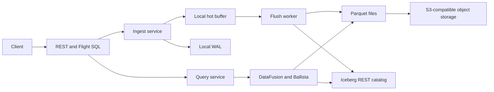
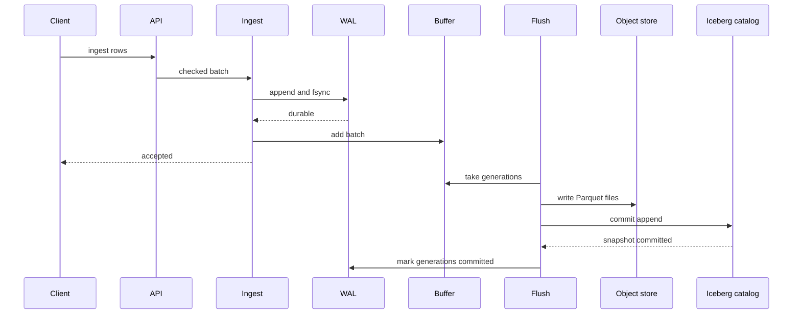

# Architecture

Navigation: [README](../README.md) | [Configuration](CONFIGURATION.md) |
[API](API.md) | [Consistency](CONSISTENCY.md)

TeoDB has one server binary named `teodb`. Config selects one of three process
roles. The same Rust crates are used in every role.

## System View

The main state has clear owners:

| State | Owner | Shared between nodes? |
|-------|-------|-----------------------|
| WAL | One data node | No |
| Hot buffer | One data node | No |
| Parquet files | Object storage | Yes |
| Table metadata | Iceberg catalog | Yes |
| Query jobs | Ballista scheduler | Yes during a scheduler run |
| Cache and spill | One process | No |

## Process Roles

| Role | Work |
|------|------|
| `standalone` | Public APIs, WAL, flush, maintenance, embedded scheduler, and executor. |
| `data-node` | Public APIs, local WAL and buffers, flush, query planning, and executor. |
| `control-plane` | Active Ballista scheduler. No public REST or Flight SQL service. |

Every data node can accept reads and writes. A load balancer can send public
traffic to any data node. A client should use stable routing when it retries a
write with an idempotency key.

The control plane does not copy WAL data and does not own table files. Its job
is to schedule query work.

## Crates

| Crate | Main work |
|-------|-----------|
| `teodb-core` | Shared domain types, errors, IDs, and boundary traits. |
| `teodb-storage` | WAL, Parquet writer, object store, cache, and spill helpers. |
| `teodb-catalog` | Iceberg REST catalog adapter and commit rules. |
| `teodb-query` | DataFusion sessions, Iceberg table providers, delete reads, and pruning. |
| `teodb-ingest` | WAL-backed ingest, hot buffers, replay, idempotency, and flush. |
| `teodb-api` | REST, Flight SQL, auth, admission limits, and API services. |
| `teodb-distributed` | Ballista, cluster status, snapshot pins, cleanup, and optional compaction. |
| `teodb-server` | Config, concrete builders, listeners, metrics, tasks, and shutdown. |
| `teodb-client` | HTTP and Flight SQL clients. |
| `teodb-test-support` | Shared test fixtures and fake services. |
| `teodb-perf-suite` | Load and benchmark tools. |

`teodb-server` is the composition root. Other crates must not read global
config or create shared services by themselves.

`teodb-core` must not depend on storage, catalog, query, API, or server code.
It holds only shared language and boundary traits.

## Write Path

The WAL append is the ingest durability point. The Iceberg commit is the query
visibility point. These are different events.

A flush uses one fixed commit ID and one fixed file set. Safe retries use the
same values. An unknown catalog result blocks writes only for that table until
TeoDB can prove the result.

See [Write Path](WRITE_PATH.md) and
[Multi-writer Operations](MULTI_WRITER_OPERATIONS.md).

## Read Path

1. The API checks the request and the caller.
2. The query service parses the SQL.
3. DataFusion builds a plan.
4. Each table scan loads and pins an Iceberg snapshot.
5. Pruning removes files and row groups that cannot match the filter.
6. Ballista runs the plan on the local or remote executors.
7. Results return as JSON or Arrow batches.
8. The query releases its snapshot pins.

Queries do not read the hot buffer. A running query keeps its chosen snapshot,
even when another writer commits a new snapshot.

In remote mode, TeoDB can use local DataFusion only when the scheduler cannot
be reached before results start. It must use the same prepared scan targets.

See [Read Path](READ_PATH.md) and [Query Engine](QUERY_ENGINE.md).

## Catalog And Object Storage

The Iceberg catalog says which files are part of a table. The object store
holds those files. A file is not visible only because it exists in the object
store. It becomes visible after a catalog commit.

TeoDB writes data files before it commits table metadata. A failed write can
leave an uncommitted file. The orphan sweeper may remove that file after the
safe age window.

TeoDB uses current Iceberg support where possible. It does not add a custom
snapshot metadata format. Snapshot metadata expiration stays off until the
Iceberg Rust library can support the required safe action. Compaction also
stays off by default until a native replace action is available.

## Background Work

The server can run these tasks:

- Timed table flush.
- Cache index save.
- Orphan file sweep.
- Snapshot pin lease renewal.
- Optional compaction. It is off by default.
- Ballista scheduler and executor tasks.
- Metrics collection.

Background tasks must stop when shutdown starts. A task failure must be visible
in logs and health state. Silent task loss is not an accepted design.

## Startup And Shutdown

Startup checks config before it opens public listeners. It then opens local
storage, connects to the catalog and object store, builds query services, and
starts the tasks for the selected role.

Shutdown follows this order:

1. Stop new public work.
2. Drain active requests.
3. Run the final flush where the role owns ingest.
4. Stop maintenance work.
5. Drain or stop Ballista work.
6. Close WAL and local state.

The process has a time limit for shutdown. It reports work that did not finish
before the limit.

## Error Boundaries

Domain errors use `TeoDBError`. REST maps them to RFC 9457 problem responses.
Flight maps them to gRPC status values.

Server logs keep the error code, message, source chain, request ID, source
location, and backtrace when useful. Client replies do not expose internal
paths or stack traces.

See [Observability](OBSERVABILITY.md) and [Debugging](DEBUGGING.md).

## Current Limits

- No cross-node WAL replication.
- No cluster-wide idempotency ledger.
- No row-level MVCC.
- No automatic data sharding or tablet movement.
- One active scheduler state is kept in memory.
- No promise of rolling upgrade or old format support during active
  development.
- Compaction and snapshot metadata expiration wait for safe upstream Iceberg
  support.

These limits are design boundaries. They must not be hidden behind a success
reply or an unsafe fallback.
