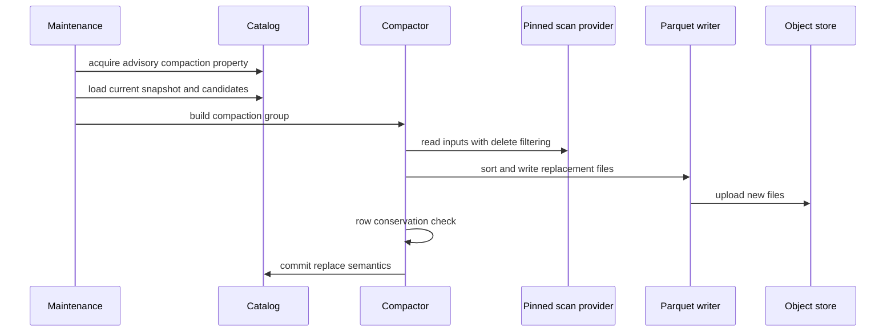

# Compaction

Navigation: [README](../README.md) | [Architecture](ARCHITECTURE.md) |
Related: [Catalog](CATALOG.md), [Storage Engine](STORAGE_ENGINE.md), [Roadmap](../ROADMAP.md)

Compaction rewrites small or delete-heavy data files into larger files. In TeoDB, the mechanics exist but the feature is disabled
by default.

## Why It Is Disabled By Default

Compaction needs a commit operation that replaces old files with new files. The current Iceberg Rust API surface used by TeoDB
does not expose the native overwrite/replace action required for the final production path.

TeoDB currently uses an interim marker model for replaced files. That is useful for development, but it should not be treated as
the final production compaction contract.

## Selection

The compactor selects file groups based on:

- Small-file pressure.
- Mid-size file grouping.
- Delete pressure.
- Maximum file count.
- Maximum total bytes.

Candidate selection is bounded so compaction work does not grow without limit.

## Execution

The compactor reads through TeoDB’s query scan machinery so position deletes are applied consistently with normal reads.

## Correctness Rules

- Running queries must keep access to pinned files.
- Row counts must be conserved after applying deletes.
- Snapshot changes during compaction must be detected.
- A failed or losing compaction must not remove live files.
- Uncommitted replacement files become orphan candidates after the retention window.

## Advisory Lock

Compaction uses table properties as an advisory lock with owner and timestamp. The lock reduces duplicate work but does not
provide correctness by itself. The catalog commit remains the correctness fence.

## Future Work

The required next step is replacing the interim marker model with a native Iceberg overwrite/replace commit path. After that,
compaction can move from disabled-by-default to an ordinary maintenance feature.
