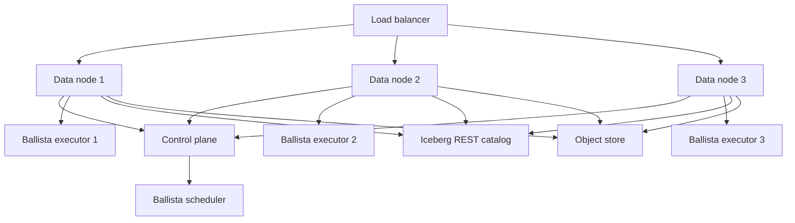
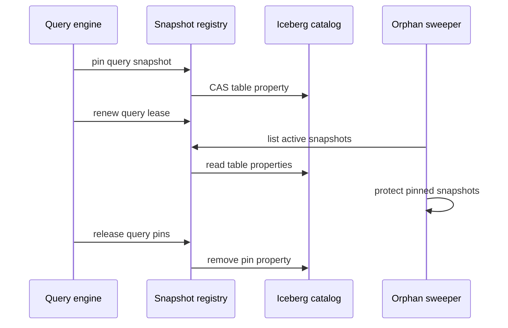

# Distributed Mode

Navigation: [README](../README.md) | [Architecture](ARCHITECTURE.md) |
Related: [Network Protocols](NETWORK_PROTOCOL.md), [Consistency](CONSISTENCY.md), [Partitioning](PARTITIONING.md)

Distributed TeoDB separates the active control plane from homogeneous data nodes.

## Topology

## Control Plane

The control plane currently runs the Ballista scheduler. It accepts internal scheduler/executor traffic and coordinates
distributed query execution.

It does not serve the public REST or Flight APIs and does not own table data.

## Data Nodes

Each data node:

- Serves REST.
- Serves Arrow Flight SQL.
- Accepts ingest and DDL.
- Owns local WAL and hot buffers.
- Flushes to object storage and Iceberg.
- Runs a Ballista executor.
- Can plan queries and submit distributed execution to the scheduler.

Because every data node can accept ingest, clients that rely on pre-flush idempotency should use stable routing.

## Query Execution

Data-node query flow:

1. The receiving data node prepares the SQL query.
2. Table scans resolve and pin Iceberg snapshots.
3. The prepared plan is submitted to the configured Ballista scheduler.
4. Executors read object-store files through the registered object store.
5. Results stream back to the client through the receiving node.

If enabled, local fallback is allowed only when the scheduler is unreachable before results begin.

## Snapshot Registry

Distributed maintenance needs to know which snapshots are still used by running queries. In standalone mode,
`InMemorySnapshotRegistry` is enough because queries and maintenance run in one process. In distributed mode, a local registry
would make an orphan sweeper on one data node blind to query pins held by another data node.

TeoDB uses `CatalogSnapshotRegistry` in data-node mode. It stores pins as Iceberg table properties with a
`teodb.pin.<query_id>` key prefix. Each pin records the query id, table, snapshot id, owner node id, creation timestamp, and lease
deadline. The registry uses catalog compare-and-swap updates, so TeoDB does not introduce a separate coordination service for
snapshot cleanup state.

Pins are leases. If a node dies without releasing a pin, another node can expire it after the deadline. Registry read failures
are treated conservatively by cleanup paths: a sweeper should skip deletion-sensitive work rather than assume no pins exist.
Release failures also fail safe. A leaked pin delays cleanup until lease expiry instead of risking deletion of files that a query
still needs.

## Readiness

Data nodes can expose readiness probes for:

- Lifecycle ready/draining state.
- Catalog reachability.
- Scheduler reachability.
- Executor quorum through scheduler API when configured.
- Buffer backlog information.

The Helm chart and Compose files use readiness to avoid routing traffic to a process that is still starting or draining.

## What Distributed Mode Does Not Do

Distributed mode is not a storage replication layer. It does not:

- Replicate node-local WAL.
- Move hot buffers between nodes.
- Elect data owners.
- Provide automatic failover for unflushed rows.
- Shard tables into owned tablets.
- Provide a consensus-backed control plane.

Those are future design areas.
