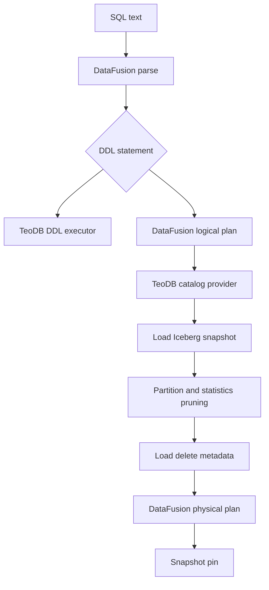

# Query Planner

Navigation: [README](../README.md) | [Architecture](ARCHITECTURE.md) |
Related: [Query Engine](QUERY_ENGINE.md), [Read Path](READ_PATH.md), [Indexes](INDEXES.md)

TeoDB query planning is DataFusion planning plus TeoDB-specific table resolution and scan construction.

## Planning Steps

## Catalog Provider

The catalog provider exposes TeoDB namespaces and tables to DataFusion. It resolves table identifiers to Iceberg-backed providers
and applies metadata caching with refresh behavior.

## Snapshot Descriptor

When a query is prepared, TeoDB records the snapshot and file information needed for execution. Distributed workers execute
against this descriptor so a query remains stable even if a flush commits a newer snapshot during execution.

## Partition Pruning

TeoDB can prune files for identity partition transforms when predicates prove a partition cannot match. Non-identity transforms
are kept conservatively unless support exists to evaluate them correctly.

## Statistics Pruning

File statistics are exposed to DataFusion pruning predicates:

- Row count.
- Null counts.
- Lower bounds.
- Upper bounds.
- Value counts where available.

If TeoDB cannot build a safe pruning predicate, it keeps the file.

## Delete Planning

Position deletes are resolved and applied during scan execution. Equality deletes are not supported yet and are rejected rather
than ignored.

## Optimizer Boundary

DataFusion owns the optimizer. TeoDB should not duplicate optimizer logic unless it has table-specific information DataFusion
cannot represent through provider APIs.
