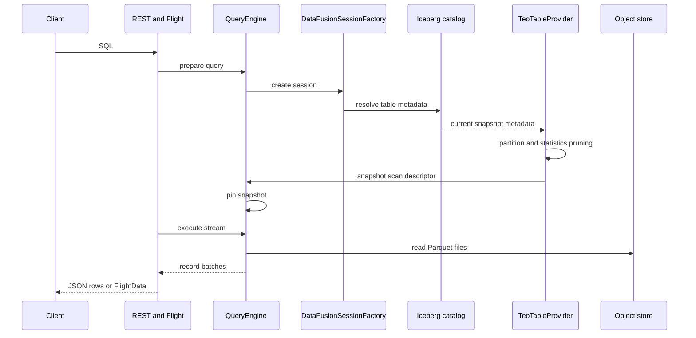

# Read Path

Navigation: [README](../README.md) | [Architecture](ARCHITECTURE.md) |
Related: [Query Engine](QUERY_ENGINE.md), [Query Planner](QUERY_PLANNER.md), [Query Execution](QUERY_EXECUTION.md), [Consistency](CONSISTENCY.md)

The read path starts with SQL and ends with JSON rows or Arrow Flight batches. It reads committed Iceberg snapshots only.

## Flow

## Snapshot Resolution

For each scanned table, TeoDB loads table metadata from the catalog and resolves the current snapshot. That snapshot is used to
build a scan descriptor. Distributed execution uses pinned descriptors so remote executors do not silently switch to a newer
snapshot.

## File Selection

TeoDB filters files before execution using:

- Iceberg snapshot metadata.
- Partition pruning for identity partition transforms.
- DataFusion pruning predicates over file statistics.
- Delete-file awareness.

If pruning cannot prove that a file is irrelevant, the file is kept.

## Position Deletes

Position delete files are loaded and applied through a physical filtering wrapper. Equality deletes are not implemented and are
rejected when encountered.

## No Hot-Buffer Overlay

Queries do not read the hot ingest buffer. A row accepted by ingest becomes query-visible only after flush commits it to the
catalog.

## Result Delivery

REST query responses serialize rows as JSON with configured limits and timeouts. Flight SQL streams Arrow `FlightData` and is the
better fit for large analytical result sets.
