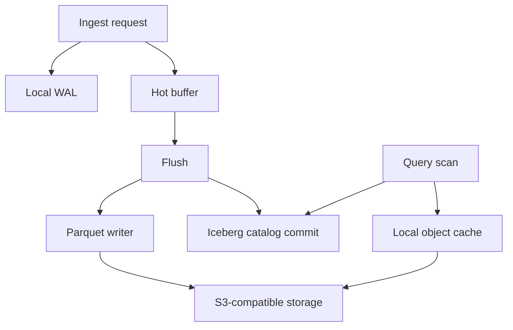

# Storage Engine

Navigation: [README](../README.md) | [Architecture](ARCHITECTURE.md) |
Related: [Write Path](WRITE_PATH.md), [Object Storage](OBJECT_STORAGE.md), [Cache](CACHE.md), [Compaction](COMPACTION.md)

TeoDB’s storage engine is not an LSM tree. It is a file-oriented OLAP storage path built from:

- A node-local WAL for unflushed ingest durability.
- A node-local hot buffer for pending batches.
- Parquet data files in object storage.
- Iceberg metadata for committed snapshots.
- A local read-through object cache.
- Local spill directories for query and compaction work.

## Storage Layers

## Local Durable State

The WAL is the only local durable write path before flush. It stores framed records with:

- A length prefix.
- CRC validation.
- A JSON header.
- Arrow IPC stream payload for append records.
- Tombstone records for dropped tables.

The WAL writer uses a queue and group commit so multiple appends can share an fsync. Segment rotation and GC are handled by the
WAL manager.

## Hot Buffer

The hot buffer holds accepted batches before flush. It tracks generations so flush can drain contiguous committed-ready ranges and
recovery can skip data already committed to the catalog.

The buffer is not a query source in the current design.

## Durable Analytical Files

Flush writes Arrow batches as Parquet files. The writer applies configured sort order where available, rolls output by size,
records row group statistics, and returns Iceberg data file metadata.

Parquet files are immutable after upload. Visibility is controlled by the Iceberg snapshot commit, not by the object store write
alone.

## Catalog State

The Iceberg catalog records which files are part of the current table snapshot. Query planning starts from the catalog, not from
listing object storage.

Object files written but not committed are orphan candidates after the configured age threshold.

## Local Cache

The cache stores whole objects under a content-addressed local directory. It is only a performance layer. If cache files are
removed, TeoDB reads from object storage again.

## Spill

DataFusion, Ballista, and compaction can spill to local disk when memory limits require it. Spill files are temporary and not part
of database durability.

## What This Storage Engine Optimizes For

- Append-heavy analytical ingest.
- Immutable columnar data files.
- Snapshot-based query planning.
- Object-store durability.
- Clear recovery from local WAL plus catalog state.

## What It Does Not Provide

- Point-update storage.
- Secondary index maintenance.
- Row-level MVCC.
- LSM memtable/SSTable compaction.
- Replicated WAL.
