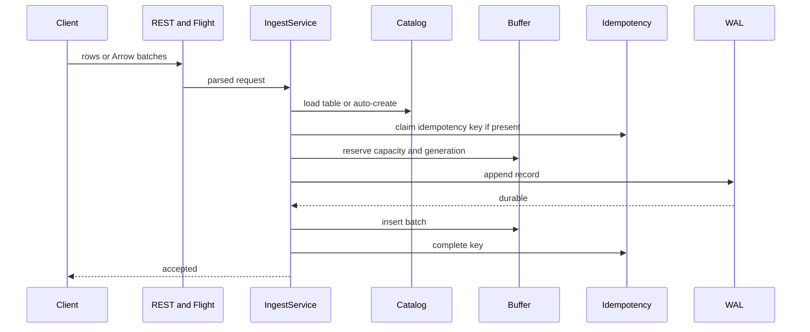

# Write Path

Navigation: [README](../README.md) | [Architecture](ARCHITECTURE.md) |
Related: [Storage Engine](STORAGE_ENGINE.md), [Consistency](CONSISTENCY.md), [Catalog](CATALOG.md)

The write path turns client input into durable WAL records, then later into query-visible Parquet files through flush.

## Ingest Flow



## REST Ingest

REST ingest accepts:

- A single JSON object.
- An array of JSON objects.
- An object with a `rows` array and optional idempotency key.

Nested JSON is flattened with dot-separated field names before schema inference/parsing.

If the target table does not exist, the ingest service can auto-create the namespace and table from inferred schema using the
configured warehouse location.

## Flight Ingest

Flight SQL `do_put` can ingest Arrow record batches. The descriptor identifies the target table as either:

- `namespace.table`
- `[namespace, table]`

The service validates the batch against the table schema, reserves buffer capacity, appends to WAL, inserts into the buffer, and
returns put metadata.

## Idempotency

Idempotency keys are per stable writer. A repeated completed key returns the
original receipt, including its `writer_id`; an in-progress key returns a
conflict.

The index is memory-resident and bounded by TTL and per-table record count. During WAL replay, TeoDB rebuilds idempotency entries
for replayed unflushed records.

Cross-writer idempotency is not implemented. A generation is likewise
writer-local and must be interpreted as `(table_uuid, writer_id, generation)`.

## WAL Append

The WAL append is the durability point for ingest. Appends are written by a dedicated writer task that batches frames and fsyncs
according to configuration.

If WAL append fails, the buffer reservation is released and the idempotency claim is aborted.

## Flush Flow

```mermaid
sequenceDiagram
    participant Loop as Flush loop
    participant Buffer
    participant Writer as Parquet writer
    participant Store as Object store
    participant Intent as Prepared sidecar
    participant Catalog
    participant WAL

    Loop->>Buffer: drain pending generations
    Loop->>Writer: write sorted Parquet
    Writer->>Store: upload files
    Writer-->>Loop: data file metadata
    Loop->>Intent: fsync exact commit ID + file set
    Loop->>Catalog: atomic append + writer checkpoint
    Catalog-->>Loop: snapshot committed
    Loop->>Buffer: mark committed
    Loop->>WAL: mark generations committed
    WAL-->>Loop: GC closed dead segments
```

Flush can run periodically, through explicit REST flush, and during shutdown.

## Commit Point

The Iceberg catalog transaction is the visibility commit. It atomically
publishes the files and advances only this writer’s checkpoint. New files use
`<table>/data/<writer_id>/<commit_id>-...parquet` for unpartitioned tables and
`<table>/data/<iceberg-url-encoded-partition>/<writer_id>/<commit_id>-...parquet`
for partitioned tables. Partition names and human-readable values use
Iceberg-compatible UTF-8 `URLEncoder` escaping, so raw values cannot create
object-key segments.

The prepared sidecar is durable before the first catalog request. All safe
retries reuse its exact commit ID and file set. It is removed only after exact
commit proof and local completion.

## Failure Handling

| Failure                                 | Result                                                                 |
|-----------------------------------------|------------------------------------------------------------------------|
| Validation failure                      | Request rejected before WAL.                                           |
| Buffer reservation failure              | Request rejected before WAL.                                           |
| WAL append failure                      | Request rejected; reservation/idempotency claim released.              |
| Process crash after WAL append          | Replay rebuilds buffer.                                                |
| Object-store write failure during flush | Batch remains pending or in-flight for retry.                          |
| Catalog conflict during flush           | Iceberg rebase with protocol validation on every metadata reload.       |
| Ambiguous catalog failure               | Exact history/checkpoint checks; persistent unknown blocks only that table. |
| Crash with request still in flight      | Recovery loads the sidecar and resolves/resumes the same logical commit. |

## Query Visibility

Rows are not visible to queries until flush commits them to the catalog. See [Consistency](CONSISTENCY.md).
